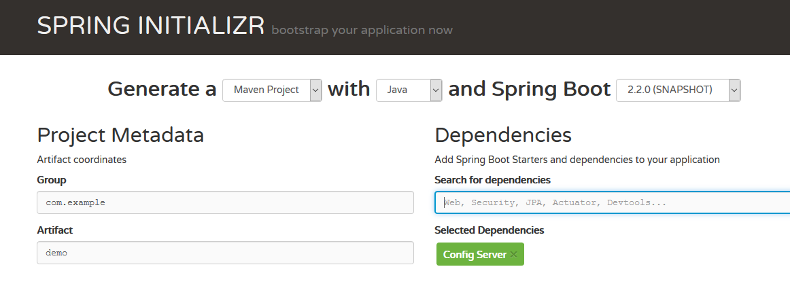

## Servidor Configuraciones en Spring Cloud

En esta ocasión vamos a usar el paquete **Spring Cloud Config** para poder tener configuraciones remotas para nuestras aplicaciones.

La idea es que nuestro programa o programas puedan ir a buscar sus parámetros de configuración a un lugar externo, de tal manera  que nuestra aplicación sea fácilmente parametrizable e incluso se puedan cambiar sus configuraciones en caliente.

Esto se utiliza ampliamente en _microservicios_ pues una mismo servicio o aplicación puede estar lanzada muchas veces en diferentes _contenedores_ y es interesante tener un lugar central desde donde se puedan aplicar las configuraciones a estos servicios.

Para ello vamos a crear un servidor de configuraciones y un cliente que buscara su configuración en ese servidor. 

El servidor de configuraciones, usara un repositorio GIT de GitHub donde estarán los ficheros de configuración.

Los datos de las aplicaciones serán los siguientes.

##### - Servidor de configuraciones

- **Proyecto**: config-server
- **Puerto**: 8888
- **Nombre Spring** : config-server
- **Servidor GIT**: https://github.com/chuchip/servercloudconfig.git

##### - Cliente de configuraciones

- **Proyecto**: config-client
- **Puerto**: 8080
- **Nombre Spring**:  config-client

Los fuentes de los programas están en:  https://github.com/chuchip/servercloudconfig


1. #### Servidor de configuraciones

La única  dependencia para poder crear un servidor de configuraciones es incluir este paquete  en nuestro proyecto **maven**

```
<dependency>
	<groupId>org.springframework.cloud</groupId>
	<artifactId>spring-cloud-config-server</artifactId>
</dependency>
```

El starter de Spring seria **Config Server**



El servidor de configuraciones se compone de una sola clase, que detallo a continuación:

```java
package com.profesorp.configserver;

import org.springframework.boot.SpringApplication;
import org.springframework.boot.autoconfigure.SpringBootApplication;
import org.springframework.cloud.config.server.EnableConfigServer;

@EnableConfigServer
@SpringBootApplication
public class ConfigServerApplication {

	public static void main(String[] args) {
		SpringApplication.run(ConfigServerApplication.class, args);
	}
}

```

Como se ve, lo único destacable es la anotación **@EnableConfigServer** . 

En el fichero **application.properties** pondremos donde debe buscar las configuraciones, con el parámetro:  **spring.cloud.config.server.git.uri**

````
spring.application.name=config-server
server.port=8888

spring.cloud.config.server.git.uri=https://github.com/chuchip/servercloudconfig.git
````

En este caso le decimos que use un servidor **Git** que tenemos alojado en **GitHub**. También podríamos especificar que el use un repositorio **GIT** local de este modo:

```
spring.cloud.config.server.git.uri=file://eclipe/spring-config/
```

Los servidores de configuración de **Spring Cloud** soportan los siguientes orígenes (backends): 

* GIT 
* Vault 
* JDBC	,

Estos orígenes incluso se pueden mezclar, de tal manera que dependiendo del perfil elegido se use uno u otro. Pero esto se escapa al ámbito de este documento.

En el caso del servidor GIT, que es el utilizado en el ejemplo, lo importante es tener un fichero que se llame como el cliente que va a solicitar los datos, terminado en **.properties**. Así si queremos guardar configuración para una aplicación cliente que se llame **config-client** , es decir que en la variable `spring.application.name`sea igual a `config-client`, deberemos tener un fichero llamado `config-client.properties`En este fichero pondremos los valores, de esta manera:

```
datosservidor.minimum=11
datosservidor.maximum=20
limites.minimum=-1
limites.maximum=2
valores.valor_fijo: VALORFIJO
valores.valor_funcion: "VALORDEFUNCION"
```

Obsérvese que el valor puede ser asignado con **:** (dos puntos) o  **=** (igual)

**NO** usar comillas para delimitar los literales, a no ser que se quiera que nuestro literal (String) incluya esas comillas.

Para ver los valores pasados a nuestros cliente, realizaremos una petición GET especificando el nombre del cliente y el perfil. 


En este caso solicitamos la configuración para el cliente `config-client`y el perfil `default`que es el perfil utilizado si no especifica ninguno.

Para ver la configuración para el perfil `production` se llamaría a la URL:http://localhost:8888/config-client/production. Lo cual muestra la siguiente salida:


Como se puede observar, muestra el contenido del fichero `config-client-production.properties`y después el contenido del fichero`config-client.properties`. 

De esta manera, si  un cliente solicita un valor y ese valor existe en el perfil solicitado, se devolverá ese valor. En caso contrario se buscaría en el perfil **default** , devolviendo el valor asignado si lo tuviera.

2. #### Cliente de configuraciones

Una vez tenemos nuestro servidor de configuraciones y levantado, pasaremos a crear el cliente.

La única dependencia en nuestro fichero **maven** será la siguiente:

```maven
<dependency>
	<groupId>org.springframework.cloud</groupId>
	<artifactId>spring-cloud-starter-config</artifactId>
</dependency>
```

Usando **Spring Initializr** seria añadir la dependencia **Config Client** . Además, para poder refrescar la configuración en caliente, añadiremos el _starter_ **Actuator**

Ahora deberemos configurar la aplicación para especificar donde esta el servidor de configuraciones, para ello, lo primero será cambiar el fichero **config.properties** por **bootstrap.properties** . En este fichero añadiremos la propiedad `spring.cloud.config.uri`especificara la URL de nuestro servidor de configuraciones.

```
spring.application.name=config-client
spring.cloud.config.uri=http://localhost:8888
#spring.profiles.active=production
management.endpoints.web.exposure.include=refresh
```

También estableceremos la propiedad `management.endpoints.web.exposure.include` a `refresh`para configurar el paquete **actuator** de tal modo que se pueda acceder a la URL `http://localhost:8080/actuator/refresh`que será la que obligara a refrescar las diferentes propiedades.

Recordar que la variable `spring.application.name`establecera el nombre de la aplicación e indicara el fichero del repositorio _git_ donde se buscaran los valores de configuración.

Con la variable `spring.profiles.active`indicariamos que perfil es el  que debemos usar. Si no ponemos ninguno (como es el caso pues esta comentada la línea), se utilizara el perfil **default**

En este ejemplo uso varios métodos para leer la configuración. 

1. ##### Crear un _componente_ que incluye la etiqueta **@ConfigurationProperties** 

En este método, que es el mas sencillo,  indicamos cual es la raíz de las propiedades a leer y luego definimos las variables que Spring debe rellenar.

En la clase `configuration.java` especificamos que queremos coger las variables que empiecen por **otrosdatos** .

```java
import org.springframework.boot.context.properties.ConfigurationProperties;
import org.springframework.stereotype.Component;
import lombok.Data;

@Data
@Component
@ConfigurationProperties("limites")
public class Configuration {
	private int minimum;
	private int maximum;	
}

```

De este modo la variable `dato1` tendrá el valor especificado en `otrosdatos.dato1` 

Si `otrosdatos.dato1`tuviera un valor que no se puede pasar a un entero nuestra aplicación fallaría, sin embargo si no encuentra el valor simplemente no lo rellena, sin dar ningún tipo de error.

Este _componente_ será inyectado a  través de una etiqueta @Autowired

```java
@Autowired
private Configuration configuration;
```


2. ##### Crear una variable con la anotación @Value

De esta manera también se leerá el valor del servidor de configuraciones. La mayor diferencia es que ese valor será fijo pues será asignado al ejecutar la aplicación y no se refrescara nunca.

```
@Value("${valores.valor_fijo}")
String valorFijo;
```

La variable `valorFijo`tendra el valor asignado en la línea: `valores.valor_fijo`

3. ##### Usar la anotación @Value en el parámetro de una función

Igualmente el valor se leerá desde el servidor de configuraciones con la ventaja de que el valor podrá ser refrescado.

```java
@GetMapping("/refrescado")
public BeanConfiguration getConfiguracionRefrescada(@Value("${valores.valor_funcion}") String valorFuncion)
	{ .... }
```

* #### Funcionamiento

En nuestro ejemplo se exponen las URL `/limites`, `refrescado`y `datos `. 

La llamada a `limites`nos devolverá esta salida:


Suponiendo que realizáramos un _commit_   de tal manera que los valores en nuestro servidor GIT hayan cambiado, sucesivas llamadas a esta URL nos mostrarían los antiguos datos, pues el cliente solo lee la configuración al principio, a no ser que se le obligue a refrescar sus datos.

Imaginemos que cambiamos el fichero `config-client.properties' de tal manera que ahora tiene estos valores

```
datosservidor.minimum=10
datosservidor.maximum=20
limites.minimum=-101
limites.maximum=201
valores.valor_fijo: OTROVALORFIJO
valores.valor_funcion: "OTROVALORDEFUNCION"
```

Hacemos el correspondiente *commit* y *push*

```
 > git commit -a -m "cambiada configuracion";git push
```

Cuando llamemos a la URL http://localhost:8080/actuator/refresh con un método POST obligaremos a Spring a llamar al servidor de configuraciones y refrescar los valores.


Como se ve, la salida de esta petición nos devuelve las variables refrescadas.

Ahora, si llamamos a http://localhost:8080/limites veríamos que el valor de **minResultados** y **maxResultados** han cambiado. Sin embargo ni **valorFijo** ni **valorFuncion**  no lo han hecho.

Si llamamos a la URL http://localhost:8080/refrescado veremos que la variable **valorFuncion**   se ha actualizado pues en la llamada esta puesta la etiqueta **@Value** de tal manera que la variable es leída en ese momento. Sin embargo la variable **valorFijo** no es cambiada pues se estableció al inicio del programa y su valor permanece inalterado.

Es importante destacar que si quitamos una variable en nuestro fichero de configuración, el valor de la variable no se pondrá a **null** sino que mantendrá el valor anteriormente establecido. Esto es valido tanto si la variable es leída con **@Value** como si utilizamos un **@ConfigurationProperties** en un **@Bean**

Y eso es todo por ahora, en próximas lecciones explicare como hacer que las configuraciones se refresquen `automagicamente`utilizando el componente  [Spring Bus Cloud](http://spring.io/projects/spring-cloud-bus)

